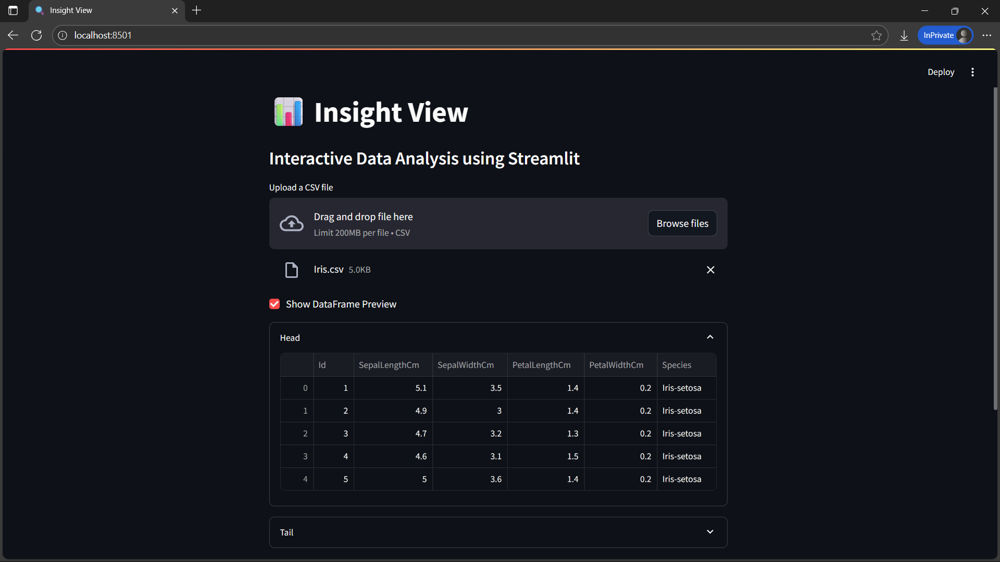

# 📊 Insight View

A simple and interactive **data analysis tool** built with Streamlit.
Upload your CSV file and quickly inspect data, check for missing values or duplicates, generate summary statistics and create interactive visualizations.



---

## 🌌 Features

This Streamlit app currently supports:
- Upload CSV files
- Data Preview (using **head** and **tail**)
- Display data types of each column
- Visualize missing values with a **heatmap**
- Identify duplicate rows
- Summary Statistics
- Interactive Visualizations (Histogram, Scatter Plot, Correlation Heatmap)

---

## 🛰️ Try it Live

👉 [Open App](https://insight-view.streamlit.app/)

---

## 🚀 Run Locally

```bash
git clone https://github.com/ravi18kumar2021/insight-view.git
cd insight-view
pip install -r requirements.txt
streamlit run app.py